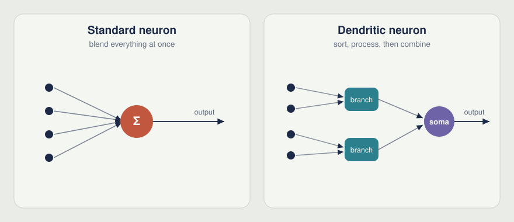
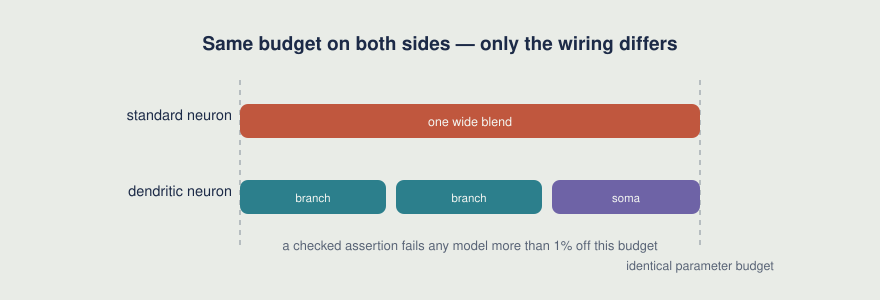
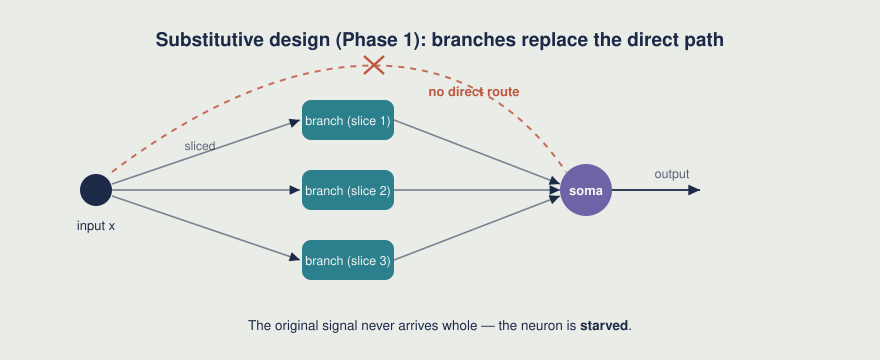
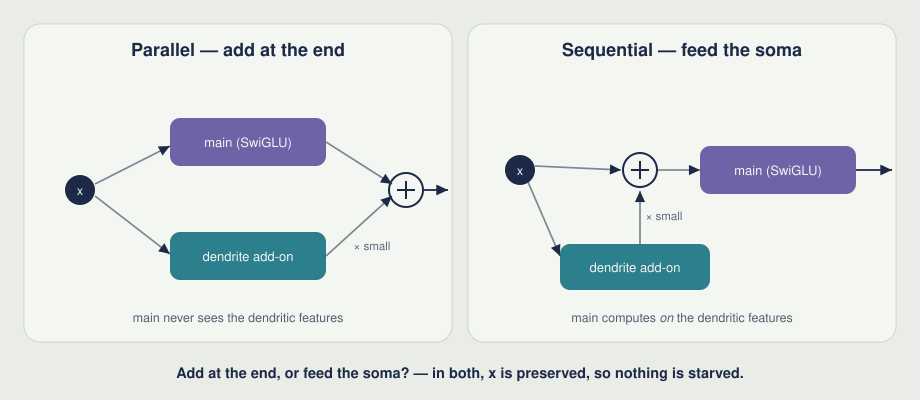
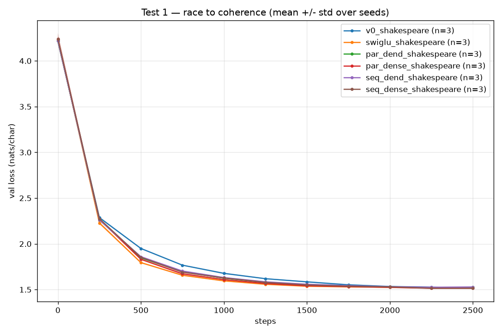
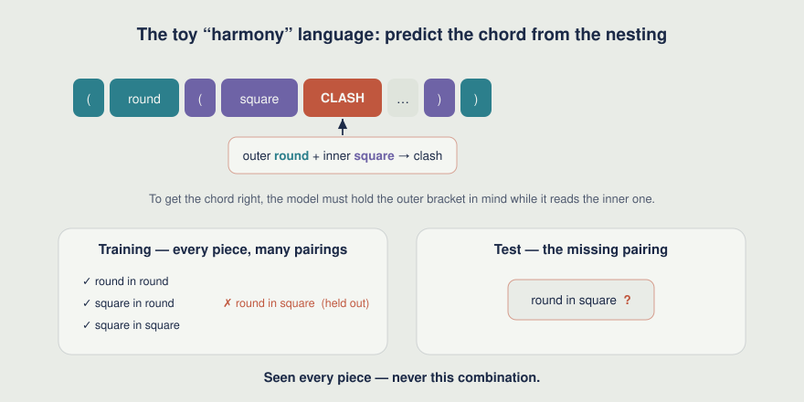
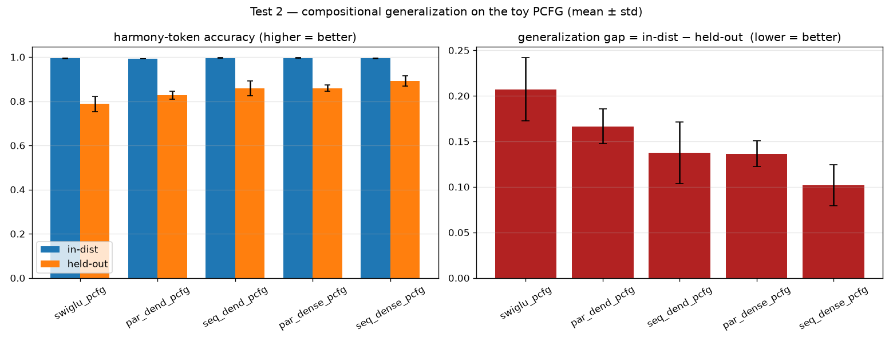
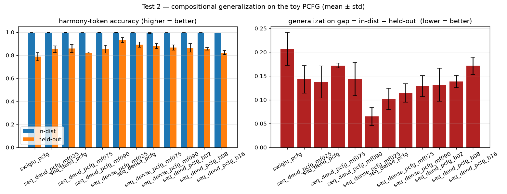
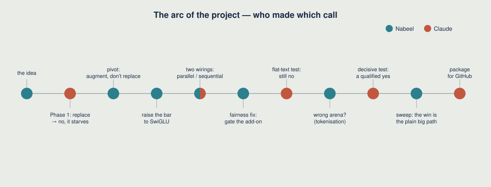

# Do smarter neurons build tidier minds?

*A small, honest experiment on whether brain-inspired neurons improve the transformer architecture — run on a single laptop GPU, written up including the wrong turns.*

**Architectures of Mind · Research idea #1**

> This write-up was written by the AI half of the project (Claude), which is also the half that wrote the code and ran the experiments. That's not a disclaimer so much as the point: the whole thing is a record of a human and an AI thinking together, so it's told that way — names where a specific person made a specific call, and no tidying-up of the dead ends. A rendered version is generated from [the GitHub repository]({{ site.github.repository_url }}). Quick links: [Reproduce](#reproduce) · [Repository map](#repository-map).

---

## The spark

The neurons inside today's AI are deliberately simple. A standard artificial neuron is a *flat sum*: it pours every input into one bucket, stirs once, and passes a single number on. A transformer — the architecture behind modern language models — is built almost entirely out of these.

Real brain cells are not like that. A single cortical neuron spreads its inputs across a branching tree of **dendrites**, lets each branch do a little processing on its own, and only then pulls the results together. So one biological neuron is less like a single switch and more like a small network in its own right. One careful study found it took an artificial network *five to eight layers deep* to imitate the behaviour of a single cortical neuron ([Beniaguev, Segev & London, 2021](https://doi.org/10.1016/j.neuron.2021.07.002)).



That contrast is the whole spark. The question Nabeel wanted to chase:

> If we rebuild the "thinking" neurons inside a transformer to work a little more like dendritic trees — sorting inputs into groups, processing each group, then combining — does the model end up organising what it learns into **cleaner, more reusable concepts**? And would that show up as **learning faster** and **handling new material better**?

That was the human contribution at the start: the question, and a sense that it was worth asking. The rest — turning it into something measurable, building it, running it, and saying plainly when the answer was "no" — was the AI's job.

---

## One rule keeps it honest

A dendritic neuron does more work inside than a plain one. Line them up with the *same number of neurons* and the fancy one wins — but only because it's secretly bigger. That would prove nothing. So the project rests on a single rule, fixed before any model was built:

> **Every comparison holds the total number of adjustable values (parameters) equal.** Any advantage has to come from how a neuron is *organised*, never from it being larger. Speed is reported alongside, and every number is checked across at least three random restarts, so a lucky run never gets mistaken for a real effect.

This is enforced in the code itself: before a model is allowed to train, an automatic check confirms it's within 1% of the baseline's size. And negative results are written up exactly like positive ones — which, as it turns out, is most of this story.



---

## Phase 1: the literal idea, and why it failed

The first design was the most literal reading of the idea: replace each feed-forward neuron with a dendritic one, where every branch sees only a **slice** of the input — the "sort into groups" step, taken at its word.

Three models were trained at an identical budget, all learning to predict the next letter of Shakespeare: a plain neuron (the baseline); a dendritic neuron with **locality**, each branch wired to its own slice (the faithful version of the idea); and a **free-wiring** dendritic control, the same branchy machinery but with every branch allowed to read everything.

That third model is the quiet workhorse of the whole project. If the locality version comes out cleaner than the free-wiring one, the *organisation* did the work. If they look the same, then any effect was just from bolting on extra machinery — not from the dendritic structure we actually care about. (This pattern — always run the "same complexity, structure removed" control — repeats at every later step.)

The verdict was a clean **no**. The locality version was *worse*, by a wide and consistent margin, and a separate depth-matched control showed the free-wiring version's small penalty was just "you added a layer." Looking inside the models, the dendritic representations were *more* tangled, not less — the opposite of the prediction.

But the *way* it failed pointed somewhere. When a branch sees only a slice **and replaces** the direct route to the rest of the neuron, it **starves** the unit of information. That's a flaw in the wiring, not a verdict on dendrites. Which set up the turn.



---

## A turn: add, don't replace

Nabeel reframed the question into something narrower and fairer:

> What if the dendrites don't *replace* the main neuron, but *add* to it? Keep the ordinary, capable neuron fully intact, and run a dendritic add-on alongside it. Now nothing can be starved. Does the enrichment beat the best ordinary neuron at the same budget — and is any gain really from the *compartmental structure*, or just from having a second path at all?

There was a quieter shift here too. Over the back-and-forth, Nabeel had been picking up the field's vocabulary, and asked what a genuinely *modern* baseline would even be — not a textbook neuron, but the thing real models use. The answer was **SwiGLU**: the gated feed-forward neuron in production systems like LLaMA and Mistral. (Roughly: instead of blending once, it computes two internal signals and lets one act as a *volume knob* on the other — a simple multiply that makes the neuron more selective.) So the bar was deliberately raised from "beat a textbook neuron" to "beat what's actually deployed."

Then a design question opened up that turned out to matter. The natural arrangement — the one Claude drew first — runs the add-on *beside* the main neuron and sums the two at the end. Looking at that diagram, Nabeel pictured what a real dendrite does: its signal doesn't sit beside the cell body casting an independent vote; it flows *into* the cell body, which then fires based on the combined input. That suggested a second wiring the first diagram hadn't — feed the dendritic output *into* the main neuron and let it compute on top of the result. Two topologies, one from a diagram and one from a mental picture of a real cell:

```
parallel     output = main(x) + small·add-on(x)        # add-on votes alongside
sequential   output = main( x + small·add-on(x) )      # add-on feeds the main neuron
```



Because the main neuron is non-linear, these are genuinely different: in the parallel form the main neuron never sees the dendritic features, while in the sequential form it computes *on* them — closer to how a real neuron integrates. And as before, a *dense* control (same budget, an ordinary add-on with no compartments) sits beside every dendritic variant, so any win can be pinned on the compartments specifically rather than on "an extra path."

---

## Keeping the test fair

Before anything ran, Nabeel raised a problem: the dendritic add-on was being built from plain (non-gated) neurons, while the baseline was gated SwiGLU. Wasn't the dendritic model then fighting with one hand tied — spending part of its budget on a primitive we already knew was weaker?

That was right, and it would have quietly skewed the headline comparison. The fix was to make the dendritic add-on *itself* gated — a SwiGLU whose internal gate is split into compartments. With that change, gating, depth, and the way signals are combined are **identical** across the dendritic variant, its dense control, and the baseline. Only the compartmentalisation differs — which is the one thing we're trying to measure. (A small bonus: the gated version sidestepped a failure mode from phase 1, so the new module was actually simpler than the old one.)

---

## First result: still no, on flat text

Six variants, parameter-matched, three seeds, on character-level Shakespeare. As a *method* the redesign worked — the augmentative variants no longer collapsed; every one landed within a whisker of SwiGLU. But the verdict on the idea was, again, no.

*(Loss below is in "nats per token" — lower means the model is less surprised by the text. At this scale, gaps of a few hundredths are real and hold up across restarts.)*

| variant | final loss (↓) | what it says |
|---|---|---|
| `par_dense` / `seq_dense` (controls) | **1.514** | best — a hair under SwiGLU |
| `swiglu` (baseline) | 1.519 | — |
| `par_dend` / `seq_dend` (dendritic) | 1.525 / 1.529 | *worse* than their own controls |

Compartmentalisation beat neither its dense control nor the SwiGLU baseline. Having an extra path helped a touch; *compartmentalising* that path gave the touch back. Looking inside, plain SwiGLU again had the cleanest, most spread-out representations. Two negatives in a row.



---

## Maybe it's the wrong test

Curious about exactly how the models were being graded, Nabeel opened the code and followed how the loss was computed — and noticed a choice that had been made in passing, and never flagged: the text was being fed in one **character at a time**. That raised a concern worth quoting:

> Character-level text forces the model to spell, then build words, then grammar, and to track long stretches of letters. That leans hard on the *attention* part of the transformer. If attention is the bottleneck, the feed-forward neurons we're actually testing might never be the thing that limits performance — so a real effect could be hidden. We should test on tasks that genuinely stress the neuron, with word-piece tokens and a controlled way of "recombining known pieces."

This is the kind of call that decides whether a "no" means *the idea is wrong* or *the test was in the wrong place*. It set up the experiment that finally moved.

---

## The decisive test: recombining known pieces

Two new tasks were built to put the idea on its home turf.

**1. A toy "harmony" language.** A small grammar of nested brackets, fed to the model one *symbol* at a time, so there's no spelling to learn — the tokens are already the meaningful units. Each kind of bracket carries a hidden tag — picture it as *round* or *square*. The twist: whenever one bracket sits directly inside another, the grammar adds a little "chord" symbol saying whether the pair **matches** (both round, or both square) or **clashes** (one of each). To predict that chord, the model has to spot the outer bracket, hold it in mind as it reads inward, find the inner bracket, and combine the two — a small but genuine act of composition.

A toy string, simplified, reads like:

```
( round   ( square   → CLASH   …  )   )
```

an outer *round* bracket, an inner *square* one — so the chord must be *clash*.

Now the real manoeuvre: we **delete certain specific pairings from training entirely** — the model may never once see a round bracket nested directly inside *that particular* square one — while making sure it has seen every bracket, and every match/clash outcome, in *other* combinations. At test time we ask for exactly the missing pairings. A model that learned the underlying *rule* gets them right; one that just memorised which pairs go together fails. And since every string is the same length whether or not it uses a held-out pairing, a gap can only mean one thing: a failure to **recombine familiar pieces in a new way** — precisely the ability the dendritic idea was meant to grant.



**2. Subword real text.** Train on Shakespeare using a 2,000-piece word-fragment vocabulary, then measure how well the model carries over to an unseen text from the same era (the King James Bible).

This is where the project finally moved — into a **qualified yes**, though not the one we expected.

*Toy language — generalisation gap, the drop from familiar to unseen combinations (lower = generalises better):*

| variant | accuracy on unseen combinations | gap (↓) |
|---|---|---|
| `swiglu` (baseline) | 0.79 | **0.207** |
| `par_dend` | 0.83 | 0.166 |
| `seq_dend` | 0.86 | 0.137 |
| `par_dense` (control) | 0.86 | 0.136 |
| `seq_dense` (control) | 0.89 | **0.102** |

*Subword real text — fit to the training-era text (lower = better):*

| variant | fit (loss) | vs SwiGLU |
|---|---|---|
| `swiglu` | 5.14 | — |
| `par_dend` | 4.88 | better |
| `seq_dend` | **4.72** | best |



Three things came out of this, all parameter-fair:

1. **The augmentative gated structure earns its keep — but only when the task stresses the neuron.** On both new tasks, every augmentative variant beat plain SwiGLU, and the best one roughly **halved** the toy-language generalisation gap. It was neutral *only* on flat character text — so the tokenisation concern was right: the earlier null was partly the wrong arena.
2. **The compartments are still not the source.** On the generalisation gap, the *plain* control was as good as or better than its compartmental twin. The honest statement: compartmentalisation does not improve composition beyond what the plain gated path already gives.
3. **Feeding the main neuron (sequential) beat voting alongside it (parallel)** on these tasks — the one place a clearly dendritic-flavoured choice helped.

On the real-text side there was a twist worth keeping in view: the compartmental version actually *fit* the training-era text better than its plain control (a reversal of phase 1) — but that better fit did **not** carry over to the unseen text any better. Better fit, not better transfer.

---

## Chasing a sweet spot

The natural follow-up, from Nabeel: maybe there's a *balance* — keep most of the budget on the ordinary main neuron and add just a *small* dendritic enrichment — that grabs the upside without the cost. So we swept the budget split (main neuron vs add-on) and the number of compartments, on the sequential variants, across both tasks.

Three clear answers came back, none of them the hoped-for one:

1. **The best balance isn't balanced — it's add-on-heavy.** Giving *more* budget to the add-on (and less to the main neuron) steadily improved fit on both tasks. The instinct to "protect the main neurons" was backwards.
2. **The best generaliser was the *plain* large add-on, not the dendritic one.** A big sequential add-on with *no* compartments cut the toy-language gap to **0.065** — under a third of the standard neuron's 0.207. Compartmentalising that same add-on made it worse, and adding *more* compartments made it worse still.
3. **Compartments bought a little fit, at the cost of generalisation.** The two goals pulled in opposite directions: the settings that fit real text best generalised worst.



So the honest answer to "can we get the best of both worlds?" is no — and the *why* is the useful part. The real lever is **enriching the neuron's input before it fires** — the large sequential gated path — and that genuinely works. **Compartmentalising** that enrichment does not: walling each branch off to its own slice of the input loses information, and the over-specialised features it produces buy a sliver of extra fit on real text while consistently *costing* generalisation. So compartments aren't a dial to tune to taste — for what we cared about, they're a net loss.

---

## What we found

Across three task regimes and a full sweep, the brain-inspired ingredient we set out to test — **compartmentalisation**, sorting inputs into isolated groups — did **not** deliver the tidier, more generalisable concepts it promised. At every fair comparison a plain control matched or beat it on generalisation, and piling on more compartments only hurt. That is a clean, repeatedly-confirmed **negative on the headline idea** — and a real result.

What the search *did* turn up deserves to be stated plainly. We ended up with an architecture that beats the plain *input → SwiGLU → output* neuron on tasks that genuinely tax the network — not by changing the neuron itself, but by **enriching its input first**: computing extra features from the same input and feeding them in before the neuron fires (the large sequential gated path). At matched parameters this halved a compositional-generalisation gap and sharply improved real-text fit.

There's a familiar shape to that. Handing a unit *precomputed features* — derived from its input and fed in before it fires — is, loosely, the same move convolutional networks make *between layers*, where each layer consumes features prepared by the one before. What's unusual here is the grain: the move earns its keep at the level of a single *neuron*, not between whole layers, which isn't where that idea is usually applied. That it works at this level at all is the part worth carrying forward.

And it does connect back to the biology — just not where we first aimed. The dendritic inspiration was never really about compartmentalisation; it was about the fact that dendrites *add to the signal a neuron integrates before it fires*. That part — enrich, then fire — is exactly what worked. Where we should be fair is that we don't yet have a faithful mathematical primitive for a dendrite: we approximated one by reusing our abstraction for a *soma* — a gated SwiGLU unit — in the dendrite's role. A truer dendritic primitive might behave differently, which is its own invitation rather than a closed door. So: a firm "no" to compartments-as-composition, and a real "yes" to the older, simpler dendritic intuition that a neuron does better when its input is enriched first.



---

## Why this might matter

Set the dendrites aside for a moment. The part worth noticing is the *shape of the work*. A non-specialist's genuine question — *do richer neurons leave visible fingerprints?* — became a controlled, multi-seed, parameter-matched study across three task regimes, with internal probes, honest nulls, a sweep, and one real secondary finding, built and run on a single 8 GB laptop GPU, each experiment costing seconds to minutes.

It's worth being plain about who did what, because the interesting thing is that *neither half could have done it alone, and both got things wrong*. Nabeel never wrote a training loop; Claude never decided what was worth asking. Nabeel supplied the direction, raised the gating confound, and suspected the test was in the wrong arena. Claude built and ran everything, designed the controls, and also made the unflagged character-level choice that nearly hid the effect. The wrong turns are kept in this write-up on purpose — the pivot, the fairness fix, the tokenisation rethink — because that back-and-forth is where the work actually happened.

There's a more personal reason this mattered to Nabeel, and it's worth putting in plain terms. These models already hold more knowledge than any one person can, and outscore most of us on a widening list of tests. So what is there left for a human mind to actually *do*? This project was, quietly, an experiment in that question: what does a person bring to research when the tool they're working with is — in several dimensions, though not yet all — more capable than they are? The answer it points to is the one sketched in essays from places like Anthropic about where this is heading: that the human's contribution shifts toward *taste and direction* — which question is worth asking, which comparison is fair, when a tidy answer should be distrusted, when a null means the test was in the wrong place. None of the findings here came from the human knowing more than the AI. They came from a person deciding what was worth knowing and refusing the convenient answer. If that is the shape of useful work in a world of more-capable tools, this was a small, hands-on rehearsal of it.

The claim isn't that this produced a breakthrough; the headline result is a negative. The claim is narrower and, maybe, more useful: the distance between *having a good question* and *getting an honest answer to it* is shorter than it used to be — and the part that stays human is deciding which questions are worth the trip.

---

## Dig deeper

- **Full technical reports**, with every number, error bar, and threat-to-validity: [REPORT_PHASE1.md]({{ site.github.repository_url }}/blob/main/REPORT_PHASE1.md) and [REPORT_PHASE2.md]({{ site.github.repository_url }}/blob/main/REPORT_PHASE2.md).
- **Design briefs**, written before any code, with predictions stated up front: [PROJECT_BRIEF_PHASE1.md]({{ site.github.repository_url }}/blob/main/PROJECT_BRIEF_PHASE1.md) and [PROJECT_BRIEF_PHASE2.md]({{ site.github.repository_url }}/blob/main/PROJECT_BRIEF_PHASE2.md).
- **Build log** — what was done at each step: [PROJECT_LOG.md]({{ site.github.repository_url }}/blob/main/PROJECT_LOG.md).

---

## Reproduce

Python 3.13; an NVIDIA GPU is recommended (developed on an RTX 4060, 8 GB; peak memory stays under 0.6 GB). Install PyTorch with CUDA, then the rest:

```bash
pip install torch --index-url https://download.pytorch.org/whl/cu124
pip install -r requirements.txt
```

```bash
# Phase 2 — Tier 1: SwiGLU vs augmentative dendrites on char-level Shakespeare (6 variants × 3 seeds)
python experiments/run_seeds.py --seeds 0 1 2
python src/aggregate.py results/agg_phase2.png \
  v0_shakespeare swiglu_shakespeare par_dend_shakespeare par_dense_shakespeare \
  seq_dend_shakespeare seq_dense_shakespeare

# Test 2 — compositional generalisation (toy grammar) and subword transfer (BPE)
python experiments/run_seeds.py --seeds 0 1 2 --configs \
  configs/swiglu_pcfg.yaml configs/par_dend_pcfg.yaml configs/seq_dend_pcfg.yaml \
  configs/par_dense_pcfg.yaml configs/seq_dense_pcfg.yaml
python src/eval_generalization.py results/analysis/test2_pcfg.png \
  swiglu_pcfg par_dend_pcfg seq_dend_pcfg par_dense_pcfg seq_dense_pcfg

# The sweet-spot sweep (budget split / number of compartments, sequential variants)
python experiments/run_sweep.py --seeds 0 1 2
```

The first run downloads TinyShakespeare (and, for the subword arm, the King James Bible) and trains a small word-piece tokeniser; everything else is config-driven and seeded for exact reproduction.

## Repository map

```
README.md                 this overview (also rendered to GitHub Pages from docs/)
docs/                     index.md (the rendered write-up) + assets/ (figures)
PROJECT_BRIEF_PHASE1.md   original design brief + predictions (phase 1)
PROJECT_BRIEF_PHASE2.md   the augmentative redesign brief (phase 2)
REPORT_PHASE1.md          phase-1 results (substitutive dendrites — negative)
REPORT_PHASE2.md          phase-2 results (augmentation, the decisive test, the sweep)
PROJECT_LOG.md            running build log
configs/                  one YAML per run (variant × dataset)
src/
  model.py                shared GPT backbone; FFN chosen by config
  ffn.py                  all FFN variants + parameter-parity checks + solvers
  train.py                training loop; logging; checkpoints; CLI overrides
  aggregate.py            multi-seed loss curves (mean ± std)
  analyze_representations.py   internal-structure probes (Test 3)
  eval_generalization.py  Test 2 — toy-grammar gap + subword transfer gap
  data/                   real_text.py · toy_language.py (grammar) · bpe*.py (subword)
experiments/              run_seeds.py (matrices) · run_sweep.py (the sweep)
results/                  logs, checkpoints, figures (gitignored — reproducible)
```

---

## License & credits

Released under the [MIT License]({{ site.github.repository_url }}/blob/main/LICENSE). Built as a human–AI collaboration: Nabeel Asif supplied the research idea, direction, and judgment; the implementation, analysis, and this write-up were produced with **Claude** (Anthropic) as the technical collaborator. *Architectures of Mind* is an open-ended series mapping observations from neuroscience onto computational ideas worth testing. This was idea #1.